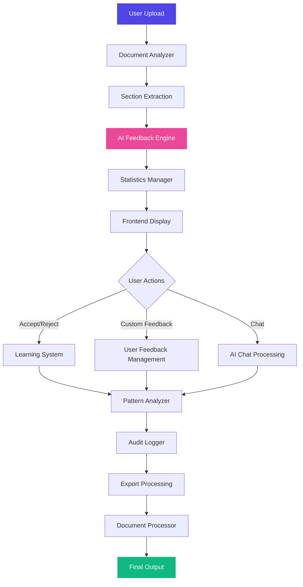

# AI-Prism Document Analysis Tool - Complete Workflow Map

## 🎯 Executive Summary

AI-Prism is a comprehensive document analysis tool that uses AI (AWS Bedrock/Claude) to analyze documents against the Hawkeye 20-point investigation framework. Users upload Word documents, receive AI-generated feedback, can add custom feedback, and export annotated documents.

## 🏗️ Architecture Overview

```
┌─────────────────┐    ┌─────────────────┐    ┌─────────────────┐
│   Entry Points  │────│  Core Analysis  │────│   Utilities     │
│                 │    │                 │    │                 │
│ • app.py        │    │ • Document      │    │ • Statistics    │
│ • main.py       │    │   Analyzer      │    │ • Audit Logger  │
│ • start_*.py    │    │ • AI Feedback   │    │ • Pattern       │
│                 │    │   Engine        │    │   Analyzer      │
└─────────────────┘    └─────────────────┘    └─────────────────┘
         │                       │                       │
         └───────────────────────┼───────────────────────┘
                                 │
         ┌─────────────────┐     │     ┌─────────────────┐
         │   Frontend UI   │─────┴─────│   Data Storage  │
         │                 │           │                 │
         │ • HTML Template │           │ • Session Data  │
         │ • JavaScript    │           │ • Learning Data │
         │ • CSS Styles    │           │ • Pattern Data  │
         └─────────────────┘           └─────────────────┘
```

## 📁 File Structure & Responsibilities

### 🚀 **Entry Points & Application Setup**

| File | Purpose | Key Functionality |
|------|---------|-------------------|
| [`app.py`](app.py:1) | **Main Flask Application** | • All API endpoints<br>• Session management<br>• Core business logic<br>• File upload handling |
| [`main.py`](main.py:1) | **Primary Entry Point** | • Environment configuration<br>• Port management<br>• Startup logging<br>• Production setup |
| [`start_aiprism.py`](start_aiprism.py:1) | **Production Startup Script** | • System verification<br>• Dependency checking<br>• AWS connection testing<br>• Error diagnostics |
| [`run_local.py`](run_local.py:1) | **Development Runner** | • Local testing mode<br>• Mock AI responses<br>• No AWS dependencies |

### 🧠 **Core Analysis Engine**

| File | Purpose | Key Functionality |
|------|---------|-------------------|
| [`core/document_analyzer.py`](core/document_analyzer.py:1) | **Document Processing** | • `.docx` file parsing<br>• Section detection<br>• Text extraction<br>• Content structure analysis |
| [`core/ai_feedback_engine.py`](core/ai_feedback_engine.py:1) | **AI Analysis Engine** | • AWS Bedrock integration<br>• Claude AI analysis<br>• Hawkeye framework application<br>• Mock response fallback |
| [`core/ai_feedback_engine_enhanced.py`](core/ai_feedback_engine_enhanced.py:1) | **Enhanced AI Analysis** | • Improved prompting<br>• Better context handling<br>• Advanced risk classification<br>• Chat query processing |

### 🛠️ **Utility Modules**

| File | Purpose | Key Functionality |
|------|---------|-------------------|
| [`utils/statistics_manager.py`](utils/statistics_manager.py:1) | **Analytics & Metrics** | • Feedback statistics tracking<br>• Risk level counting<br>• Acceptance rate calculation<br>• Performance metrics |
| [`utils/document_processor.py`](utils/document_processor.py:1) | **Document Generation** | • Word document creation<br>• Comment insertion<br>• XML manipulation<br>• Final output generation |
| [`utils/pattern_analyzer.py`](utils/pattern_analyzer.py:1) | **Pattern Recognition** | • Cross-document analysis<br>• Recurring issue detection<br>• Trend identification<br>• Pattern reporting |
| [`utils/audit_logger.py`](utils/audit_logger.py:1) | **Activity Tracking** | • User action logging<br>• System event recording<br>• Performance metrics<br>• Audit trail generation |
| [`utils/learning_system.py`](utils/learning_system.py:1) | **AI Learning** | • User preference tracking<br>• Feedback pattern analysis<br>• Learning metrics<br>• Recommendation generation |

### 🎨 **Frontend Interface**

| File | Purpose | Key Functionality |
|------|---------|-------------------|
| [`templates/enhanced_index.html`](templates/enhanced_index.html:1) | **Main HTML Interface** | • Complete web interface<br>• Responsive design<br>• Dark mode support<br>• Interactive elements |
| [`static/js/app.js`](static/js/app.js:1) | **Application Entry** | • Core JavaScript loader<br>• Main app initialization<br>• Module coordination |

### 📱 **JavaScript Modules**

| File | Purpose | Key Functionality |
|------|---------|-------------------|
| [`static/js/button_fixes.js`](static/js/button_fixes.js:1) | **Core UI Functions** | • Button event handlers<br>• Modal management<br>• Progress displays<br>• Export functions |
| [`static/js/text_highlighting.js`](static/js/text_highlighting.js:1) | **Text Highlighting** | • Text selection handling<br>• Highlight creation<br>• Comment attachment<br>• Color management |
| [`static/js/user_feedback_management.js`](static/js/user_feedback_management.js:1) | **Custom Feedback** | • User feedback display<br>• Real-time updates<br>• Activity logging<br>• Management interface |
| [`static/js/custom_feedback_functions.js`](static/js/custom_feedback_functions.js:1) | **AI Suggestion Feedback** | • AI feedback enhancement<br>• Custom comments on AI<br>• Form management<br>• Button state updates |
| [`static/js/progress_functions.js`](static/js/progress_functions.js:1) | **Progress Management** | • Loading animations<br>• Section loading<br>• Media rotation<br>• Progress tracking |
| [`static/js/enhanced_help_system.js`](static/js/enhanced_help_system.js:1) | **Help & Tutorials** | • Interactive tutorials<br>• FAQ management<br>• Keyboard shortcuts<br>• Feature explanations |

## 🔄 **Complete Data Flow Workflow**

### 📤 **1. Document Upload Phase**
```
User Action: Upload .docx file
     ↓
[Frontend] File validation & upload
     ↓
[app.py:/upload] Endpoint receives file
     ↓
[DocumentAnalyzer] Extracts sections from .docx
     ↓
[Session Management] Creates ReviewSession object
     ↓
[Frontend] Displays sections in dropdown
```

### 🧠 **2. AI Analysis Phase**
```
User Action: Select section OR automatic analysis
     ↓
[Frontend] Calls /analyze_section endpoint
     ↓
[app.py:/analyze_section] Validates request
     ↓
[AIFeedbackEngine] Analyzes content with:
  • AWS Bedrock/Claude integration
  • Hawkeye framework prompts
  • Section-specific guidance
  • Mock fallback responses
     ↓
[Response Processing] Validates & formats feedback
     ↓
[StatisticsManager] Updates analytics
     ↓
[AuditLogger] Records analysis event
     ↓
[Frontend] Displays feedback items with actions
```

### ✅ **3. User Interaction Phase**
```
User Actions: Accept/Reject AI feedback OR Add custom feedback
     ↓
[Accept/Reject Path]                [Custom Feedback Path]
     ↓                                       ↓
[app.py:/accept_feedback]            [app.py:/add_custom_feedback]
[app.py:/reject_feedback]                    ↓
     ↓                              [Custom feedback creation]
[Session state update]                      ↓
     ↓                              [User feedback display]
[Statistics tracking]                       ↓
     ↓                              [Real-time activity logging]
[Learning system update]
     ↓
[Frontend state update]
```

### 💬 **4. Chat Interaction Phase**
```
User Action: Send chat message
     ↓
[Frontend] Chat message handling
     ↓
[app.py:/chat] Chat endpoint
     ↓
[AIFeedbackEngine] Process chat query with:
  • Current section context
  • Existing feedback context
  • Hawkeye framework knowledge
     ↓
[Response formatting] & [Chat history storage]
     ↓
[Frontend] Display AI response
```

### 📊 **5. Analytics & Monitoring Phase**
```
Continuous Background Processing:
     ↓
[StatisticsManager] Tracks:
  • Feedback acceptance rates
  • Risk level distribution
  • User engagement metrics
     ↓
[PatternAnalyzer] Identifies:
  • Recurring issues
  • Cross-document patterns
  • Category trends
     ↓
[AuditLogger] Records:
  • All user actions
  • System performance
  • Error events
     ↓
[LearningSystem] Learns:
  • User preferences
  • Feedback patterns
  • Improvement areas
```

### 📄 **6. Document Export Phase**
```
User Action: Complete Review
     ↓
[app.py:/complete_review] Endpoint
     ↓
[DocumentProcessor] Creates Word document:
  • Inserts accepted feedback as comments
  • Adds custom user feedback
  • Formats with proper styling
  • Generates XML structure
     ↓
[File Creation] & [Download preparation]
     ↓
[Frontend] Download interface
```

## 🔗 **Key Component Interactions**

### **Session Management Flow**
```
ReviewSession Object (In Memory)
├── Document metadata
├── Section content
├── AI feedback data
├── User feedback tracking
├── Accepted/rejected items
├── Chat history
├── Activity logs
└── Learning data
```

### **Frontend-Backend Communication**
```
Frontend JavaScript ←→ Flask API Endpoints
     ↓
• File uploads via FormData
• AJAX calls for section analysis  
• Real-time feedback updates
• Chat message exchange
• Statistics requests
• Export operations
```

### **AI Integration Architecture**
```
User Request
     ↓
[AI Engine] → [AWS Bedrock Check]
     ├── ✅ AWS Available → [Claude Analysis]
     └── ❌ AWS Unavailable → [Mock Response]
     ↓
[Response Processing] → [Frontend Display]
```

## 🎯 **Core Business Logic**

### **Document Analysis Workflow**
1. **Document Upload** → Document parsing → Section extraction
2. **Section Analysis** → AI processing → Feedback generation
3. **User Review** → Accept/reject/add feedback → Statistics update
4. **Chat Support** → Context-aware AI assistance → Learning update
5. **Final Export** → Comment insertion → Document generation

### **Data Persistence Strategy**
- **Session Data**: In-memory during active session
- **Learning Data**: Persistent JSON files in `/data/` directory
- **Pattern Data**: Cross-session pattern tracking
- **Audit Logs**: Comprehensive activity logging
- **Statistics**: Real-time calculation with caching

## 🔧 **Technical Implementation Details**

### **Backend (Flask) Structure**
- **Route Handlers**: 15+ endpoints for different operations
- **Session Management**: UUID-based session tracking
- **Error Handling**: Comprehensive try-catch with fallbacks
- **File Management**: Secure upload with validation
- **API Design**: RESTful endpoints with JSON responses

### **Frontend (JavaScript) Structure**
- **Modular Design**: 10+ specialized JS files
- **Event Handling**: Comprehensive user interaction management
- **State Management**: Global variables with proper scoping
- **Real-time Updates**: Dynamic DOM manipulation
- **Responsive Design**: Mobile-first approach

### **AI Integration Details**
- **Primary AI**: AWS Bedrock with Claude models
- **Fallback System**: Mock responses for offline/testing
- **Context Awareness**: Section-specific analysis
- **Learning Loop**: User feedback → AI improvement
- **Prompt Engineering**: Hawkeye framework integration

## 🎪 **Feature Ecosystem**

### **Core Features**
1. **Document Analysis** - AI-powered content review
2. **Interactive Feedback** - Accept/reject AI suggestions
3. **Custom Feedback** - User-generated insights
4. **Text Highlighting** - Visual comment system
5. **AI Chat Assistant** - Context-aware help
6. **Statistics Dashboard** - Real-time analytics
7. **Pattern Recognition** - Cross-document insights
8. **Learning System** - AI adaptation to user preferences

### **Advanced Features**
1. **Dark Mode** - Complete theme switching
2. **Keyboard Shortcuts** - Power user efficiency
3. **Export Systems** - Multiple format support
4. **Activity Logging** - Comprehensive audit trails
5. **Progress Tracking** - Visual feedback on operations
6. **Responsive Design** - Mobile/tablet optimization
7. **Error Recovery** - Graceful fallback handling
8. **Tutorial System** - Interactive user guidance

## 🔄 **Data Flow Summary**



## 🎭 **Component Dependencies**

### **Import Hierarchy**
```
app.py
├── core.document_analyzer → DocumentAnalyzer
├── core.ai_feedback_engine → AIFeedbackEngine  
├── utils.statistics_manager → StatisticsManager
├── utils.document_processor → DocumentProcessor
├── utils.pattern_analyzer → DocumentPatternAnalyzer
├── utils.audit_logger → AuditLogger
└── utils.learning_system → FeedbackLearningSystem
```

### **Frontend Script Loading Order**
```
enhanced_index.html
├── static/js/app.js (Entry point)
├── static/js/button_fixes.js (Core functionality)
├── static/js/missing_functions.js
├── static/js/text_highlighting.js (Text features)
├── static/js/custom_feedback_functions.js (AI enhancement)
├── static/js/user_feedback_management.js (User feedback)
├── static/js/custom_feedback_help.js
├── static/js/text_highlight_comments.js
├── static/js/enhanced_help_system.js (Help system)
└── static/js/custom_feedback_fix.js (Bug fixes)
```

## 🎪 **User Journey Flow**

### **Typical User Workflow**
1. **🚀 Start** → Access web interface
2. **📤 Upload** → Choose .docx document (+ optional guidelines)
3. **⚙️ Configure** → Select guidelines preference
4. **🔍 Analyze** → AI processes all sections automatically
5. **📊 Review** → Navigate sections, view AI feedback
6. **✅ Decide** → Accept/reject feedback items
7. **✏️ Enhance** → Add custom feedback and comments
8. **🎨 Highlight** → Select text and add specific comments
9. **💬 Chat** → Ask AI questions about analysis
10. **📈 Monitor** → View statistics and patterns
11. **✅ Complete** → Generate final document with comments
12. **📥 Export** → Download annotated document

### **Power User Features**
- **⌨️ Keyboard Shortcuts** - Rapid navigation and actions
- **🌙 Dark Mode** - Comfortable viewing experience
- **📊 Advanced Analytics** - Deep insight into feedback patterns
- **🧠 AI Learning** - Personalized suggestions over time
- **📋 Activity Logs** - Complete audit trail
- **🔄 Pattern Recognition** - Cross-document insights

## 🎯 **Business Logic Flow**

### **Session Lifecycle**
```
Session Creation → Document Upload → Analysis Processing → 
User Interaction → Feedback Collection → Learning Update → 
Final Export → Session Cleanup
```

### **AI Processing Pipeline**
```
Document Content → Section-Specific Prompts → Hawkeye Framework → 
Claude Analysis → Response Validation → Feedback Formatting → 
Statistics Update → Frontend Display
```

### **User Feedback Loop**
```
AI Suggestion → User Decision → Learning System → Pattern Analysis → 
Future Improvement → Better Suggestions
```

## 🔧 **Technical Architecture**

### **Backend Components**
- **Web Framework**: Flask with route-based architecture
- **AI Integration**: AWS Bedrock with Claude 3 Sonnet
- **Document Processing**: python-docx with XML manipulation  
- **Data Storage**: In-memory sessions + persistent JSON files
- **Analytics**: Real-time statistics with caching
- **Logging**: Comprehensive audit trail system

### **Frontend Components**
- **UI Framework**: Pure HTML5/CSS3/JavaScript
- **Responsive Design**: CSS Grid and Flexbox
- **State Management**: Global JavaScript objects
- **Real-time Updates**: AJAX with dynamic DOM updates
- **User Experience**: Progressive enhancement

### **Integration Points**
- **AI Service**: AWS Bedrock API integration
- **File Handling**: Multipart form uploads
- **Export System**: Multiple format generation
- **Error Recovery**: Graceful degradation
- **Performance**: Caching and optimization

## 🎪 **Feature Matrix**

| Category | Features | Implementation Files |
|----------|----------|---------------------|
| **Core Analysis** | Document parsing, AI analysis, Section detection | `core/*.py` |
| **User Interface** | Web interface, Dark mode, Responsive design | `templates/*.html`, `static/js/*.js` |
| **Feedback Management** | Accept/reject, Custom feedback, Text highlighting | `static/js/user_feedback_*.js` |
| **AI Integration** | Claude analysis, Chat assistant, Learning system | `core/ai_feedback_engine.py`, `utils/learning_system.py` |
| **Analytics** | Statistics, Patterns, Audit logs | `utils/statistics_manager.py`, `utils/pattern_analyzer.py` |
| **Export/Import** | Document generation, Multiple formats | `utils/document_processor.py` |
| **User Experience** | Tutorials, Help system, Shortcuts | `static/js/enhanced_help_system.js` |

## 🚀 **Deployment Architecture**

### **Production Setup**
```
AWS App Runner
├── Environment Configuration
├── AWS Bedrock Integration  
├── Port Management (0.0.0.0)
├── Production-ready Flask setup
└── Error handling & logging
```

### **Development Setup**
```
Local Development
├── Mock AI responses
├── No AWS dependencies
├── Debug mode enabled
├── Hot reload disabled
└── Local file storage
```

This comprehensive workflow map shows how AI-Prism integrates multiple sophisticated components to deliver a professional document analysis experience with AI-powered insights, user customization, and export capabilities.